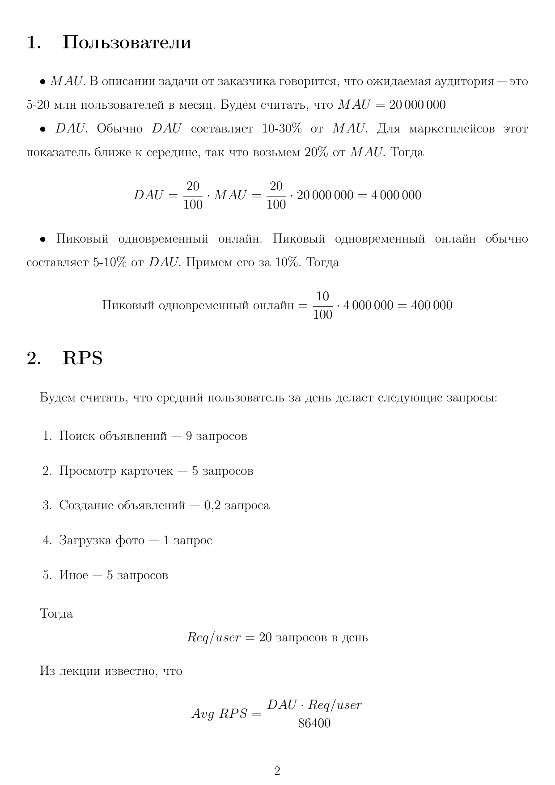
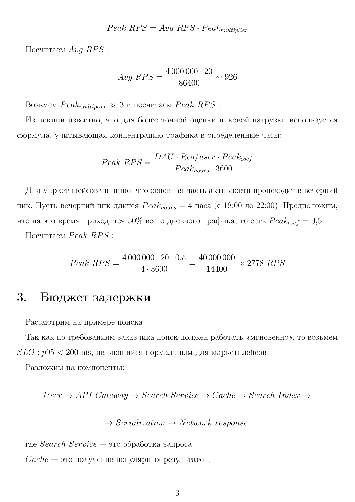
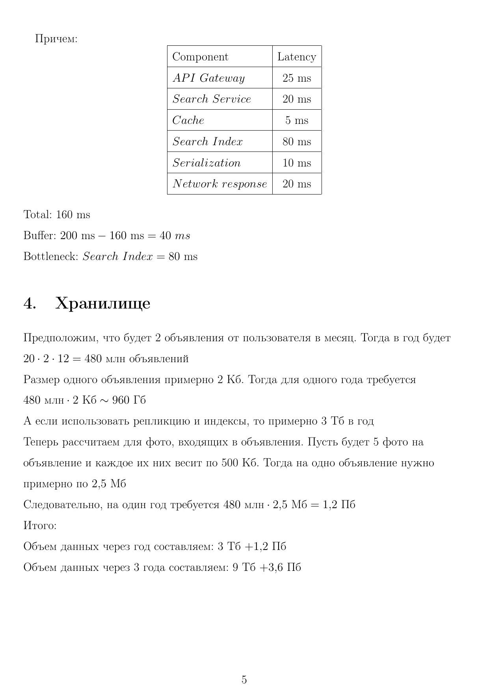
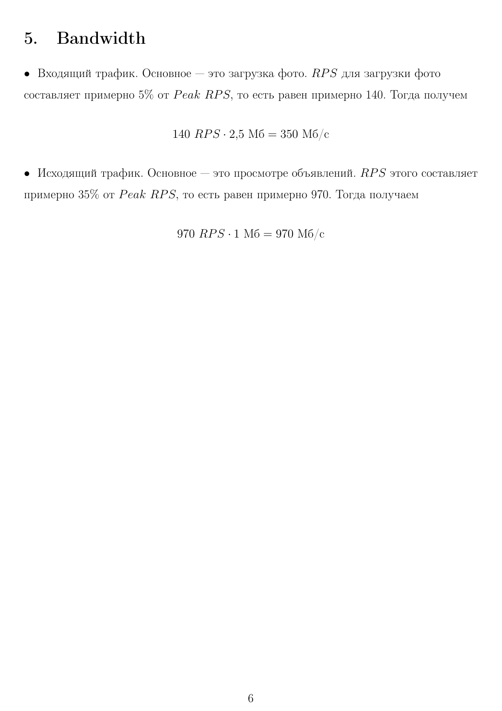

### Функциональные требования

ФТ-001: Авторизация и управление профилем
Пользователь может зарегистрироваться, авторизоваться в системе и управлять своими данными через личный кабинет, в котором доступна история его объявлений, активные подписки и история платежных операций.

ФТ-002: Создание объявления и загрузка медиа
Пользователь может создать новое объявление, указав категорию, свойства товара, заголовок, текстовое описание, цену и прикрепить ограниченное количество фотографий.

ФТ-003: Модерация контента
Каждое объявление проходит обязательную модерацию до публикации: каждое новое или отредактированное объявление проходит автоматическую проверку. Также доступна модерация в ручном режиме после публикации.

ФТ-004: Полнотекстовый поиск и фильтрация
Пользователь может осуществлять быстрый полнотекстовый поиск по заголовкам и описаниям опубликованных объявлений, а также применять фильтры (по категории, региону, цене и дате), получая результаты с учетом оплаченного продвижения.

ФТ-005: Оплата продвижения с честной активацией
Пользователь может оплатить услугу продвижения объявления на этапе его создания или редактирования. Система гарантирует сохранение платежа, при этом активация услуги происходит строго после успешной публикации объявления.

ФТ-006: Подписки и уведомления о новых объявлениях
Пользователь может сохранить параметры поискового запроса и подписаться на него. Система будет отправлять пользователю email-уведомления при появлении новых объявлений, соответствующих критериям.

### Нефункциональные требования

НФТ-001: Задержка полнотекстового поиска
SLI: Задержка p99 HTTP-ответов на запросы поиска с применением фильтров (категория, регион, цена).
SLO: < 200 мс при пиковой нагрузке до X RPD (Взять из части 3)
Оценка архитектурной значимости:
Влияние на структуру: High — Требует внедрения специализированного поискового движка (Elasticsearch) поверх основной БД и механизма CDC (Change Data Capture) для синхронизации.
Стоимость изменения: High — Заменить технологию полнотекстового поиска на поздних этапах разработки критически дорого.
Бизнес-риск: High — Поиск является главной страницей. Задержки приведут к моментальному оттоку пользователей.
Архитектурно-значимый: Да (3 из 3 = High)

НФТ-002: Сохранность данных транзакций и оплат
SLI: Процент потерянных записей о транзакциях и фактах оплаты услуг продвижения.
SLO: 0% потерь (Гарантия Exactly-Once семантики).
Оценка архитектурной значимости:
Влияние на структуру: High — Требует изоляции сервиса оплат, использования паттерна Transactional Outbox, надежного брокера сообщений и ключей идемпотентности.
Стоимость изменения: High — Перепроектирование транзакционного контура в микросервисах — одна из самых дорогих задач.
Бизнес-риск: High — Потеря платежей несет прямые финансовые убытки и юридические риски.
Архитектурно-значимый: Да (3 из 3 = High)

НФТ-003: Доступность каталога и поиска
SLI: Доля успешных ответов (HTTP 200-299) на эндпоинтах поиска и карточек объявлений.

SLO: 99.99% uptime в год (допускается не более ~53 минут даунтайма в год).
Оценка архитектурной значимости:
Влияние на структуру: High — Требует настройки кластеризации БД, репликации поисковых индексов, паттерна Circuit Breaker и многоуровневого кэширования (Redis, CDN).
Стоимость изменения: Medium — Добавить кэширование и реплики можно итеративно в процессе роста.
Бизнес-риск: High — Недоступность каталога блокирует абсолютное большинство пользовательских сессий.
Архитектурно-значимый: Да (2 из 3 = High)

НФТ-004: Скорость работы автоматической модерации
SLI: Задержка автоматической проверки от момента сохранения объявления до вынесения решения алгоритмом.
SLO: p95 < 5 секунд.
Оценка архитектурной значимости:
Влияние на структуру: Medium — Требует переноса логики скоринга в асинхронные фоновые процессы (background workers), чтобы не блокировать UI пользователя.
Стоимость изменения: Medium — Разделение синхронного сохранения и асинхронной проверки требует внедрения брокера сообщений.
Бизнес-риск: High — Очередь на автомадерацию блокирует публикации и замораживает доходы от продвижения.
Архитектурно-значимый: Да (2 из 3 = High/Medium, бизнес-риск High)

НФТ-005: Масштабируемость и задержка загрузки медиафайлов
SLI: Задержка отдачи первой фотографии (миниатюры) при открытии карточки объявления.
SLO: p99 < 150 мс. Пропускная способность (Upload): до 10 000 параллельных загрузок файлов до 10 МБ.
Оценка архитектурной значимости:
Влияние на структуру: High — Исключает хранение медиа на серверах приложения. Требует S3-совместимого хранилища, фоновой нарезки миниатюр и обязательного использования CDN.
Стоимость изменения: High — Миграция терабайтов файлов из неудачного хранилища занимает месяцы.
Бизнес-риск: Medium — Текстовое описание будет доступно даже при временных сбоях с загрузкой фото.
Архитектурно-значимый: Да (2 из 3 = High)

НФТ-006: Задержка отправки уведомлений по подпискам
SLI: Время от появления объявления в поисковой выдаче до отправки события в сервис Email/Push-рассылок подписанным пользователям.
SLO: p95 < 5 минут.
Оценка архитектурной значимости:
Влияние на структуру: Medium — Логика матчинга покупок требует отдельных консьюмеров, читающих поток событий.
Стоимость изменения: Low — Данную функцию можно реализовать изолированно от ядра платформы.
Бизнес-риск: Low — Небольшая задержка уведомления не ломает основной пользовательский флоу.
Архитектурно-значимый: Нет (Оценка 1/3 Medium, реализуется типовыми cron-задачами или стримингом).

НФТ-007: Масштабируемость (Scalability)
SLI: Способность системы поддерживать целевые показатели времени ответа (p99 < 200 мс) при кратном увеличении пользовательской базы.
SLO: Архитектура должна поддерживать горизонтальное масштабирование (scale-out) без переписывания ядра для обеспечения 2x-3x роста аудитории (с 20 млн до 40-60 млн MAU) в течение 1-3 лет.
Оценка архитектурной значимости:
Влияние на структуру: High — Требует изначально закладывать stateless-сервисы, шардирование БД и использование облачных auto-scaling групп.
Стоимость изменения: High — Переход от монолита/stateful к масштабируемой распределенной архитектуре позже потребует полной остановки развития продукта.
Бизнес-риск: Medium — Если рост будет постепенным, есть время на адаптацию, но резкий скачок ("эффект Пикабу") положит систему.
Архитектурно-значимый: Да (2 из 3 = High)

### Capacity Estimation

### Допущения, ограничения и открытые вопросы

#### 1. Допущения (Assumptions)
- **Storage worst-case:** Оценка объема хранилища (Часть 3) сделана по верхней границе: предполагаем, что на 1 MAU приходится 2 объявления в месяц, чтобы заложить максимальный бюджет на инфраструктуру.
- **Eventual Consistency поиска:** Для обеспечения p99 < 200 мс в поиске мы допускаем задержку (staleness) до 2-3 минут между моментом одобрения объявления и его появлением в поисковой выдаче.

#### 2. Ограничения (Constraints)
- **Оптимизация медиа:** Хранение исходных фото при 20 млн MAU экономически нецелесообразно. Лимит: до 8 фото на объявление, макс. размер оригинала 5 МБ. Сервер пережимает фото в JPEG (не более 1080p) и удаляет оригиналы.
- **Лимиты модерации:** Модерация изображений ресурсоемка (CV/ML), поэтому автоматической проверке подвергается только текстовое содержимое объявлений (regex, стоп-слова, спам-фильтры).

#### 3. Открытые вопросы (К заказчику)
- **Политика хранения (Retention Policy):** Как долго система должна хранить снятые с публикации, удаленные пользователем или заблокированные модерацией объявления и привязанные к ним фото?
- **Модель оплат:** Кто выступает эквайером? Требуется ли введение «внутреннего кошелька» (баланса пользователя) или оплата идет банковской картой за каждую услугу (продвижение) отдельно?
- **Модерация фото:** Допустимо ли полностью отказаться от автоматического скоринга фотографий, переложив эту задачу на пост-модерацию по жалобам пользователей?

#### 4. Выявленные противоречия и их разрешение

**Противоречие 1: Оплата продвижения до окончания модерации**
- *Конфликт:* Заказчик не хочет терять платежи из-за долгой модерации. Но если пользователь оплатит 24 часа продвижения, а объявление провисит в проверке 5 часов, клиент потеряет деньги и время. Ждать окончания модерации для холдирования средств нельзя (истечет сессия эквайринга).
- *Решение:* Разделение биллинга и бизнес-логики. Оплата списывается сразу при создании объявления. Платеж сохраняется в системе, но услуге присваивается статус `pending`. Таймер оплаченного продвижения стартует строго в момент перехода объявления в статус `published`.

**Противоречие 2: Мгновенный поиск vs. Ограниченный бюджет**
- *Конфликт:* Сложные полнотекстовые поисковые запросы с фильтрами напрямую в реляционную БД при 20 млн MAU положат систему, а масштабирование (scale-up) master-базы выйдет за рамки бюджета.
- *Решение:* Паттерн CQRS. Реляционная БД выступает только как источник истины (write-модель) и для транзакций оплат. Для поиска поднимается отдельный дешевый кластер Elasticsearch (read-модель). Данные синхронизируются асинхронно через CDC (Change Data Capture) / брокер сообщений.

**Противоречие 3: Обязательная модерация vs. Скорость публикации**
- *Конфликт:* Поток контента от аудитории до 20 млн человек несовместим с требованиями ручной пре-модерации — это слишком дорого и нарушает Time-to-Market публикаций.
- *Решение:* Ручная пре-модерация отменяется. 100% объявлений проходят быструю автоматическую проверку текста. Ручная модерация (людьми) подключается только для: а) пограничных вердиктов алгоритма до публикации, б) жалоб пользователей на уже опубликованные объявления.

